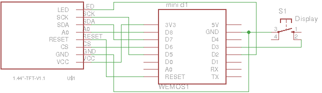

# WiFiWeatherGuy
WeatherGuy for ESP8266.

## Hardware
- Wemos D1 Mini
- ILI9163-based TFT display, see [here](http://henrysbench.capnfatz.com/henrys-bench/arduino-displays/arduino-1-44-in-spi-tft-display-tutorial/)

## Software
- Arduino 1.8.4
- [ILI9163 library](https://github.com/sumotoy/TFT_ILI9163C)
- [ESP8266 for Arduino](https://github.com/esp8266/Arduino.git)
- [Arduino ESP8266 filesystem uploader](https://github.com/esp8266/arduino-esp8266fs-plugin)

## Installation
- Get a Wunderground [API key](https://www.wunderground.com/weather/api/d/docs)
- Edit data/config.txt with your preferences
- Upload the filesystem (Tools > ESP8266 Sketch Data Upload)
- Upload the sketch

## Note
The weather icons must be 24-bit bitmaps; convert from GIF as follows:

    % convert foo.gif -type truecolor foo.bmp 

