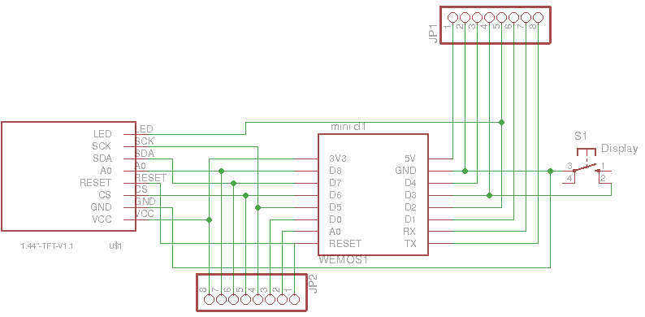

# WiFiWeatherGuy
WeatherGuy for ESP8266.



## Hardware
- Wemos D1 Mini
- ILI9163-based TFT display, see [here](http://henrysbench.capnfatz.com/henrys-bench/arduino-displays/arduino-1-44-in-spi-tft-display-tutorial/)

## Software
- Arduino 1.8.4
- [ILI9163 library](https://github.com/Bodmer/TFT_eSPI) 1.0.0
- [ESP8266 for Arduino](https://github.com/esp8266/Arduino.git) 2.4.2
- [Arduino ESP8266 filesystem uploader](https://github.com/esp8266/arduino-esp8266fs-plugin)
- [ArduinoJson](http://arduinojson.org/) 5.13.2

## Installation
- Get a Wunderground [API key](https://www.wunderground.com/weather/api/d/docs)
- Edit data/config.json with your preferences
- Edit TFT_eSPI/User_Setup_Select.h to include User_Setup.h
- Edit TFT_eSPI/User_Setup.h:
```C
#define ILI9163_DRIVER
#define TFT_WIDTH  128
#define TFT_HEIGHT 128
#define TFT_CS   PIN_D6  // Chip select control pin D8
#define TFT_DC   PIN_D8  // Data Command control pin
#define TFT_RST  -1  // Set TFT_RST to -1 if the display RESET is connected to NodeMCU RST or 3.3V
#define SPI_FREQUENCY  40000000 // Maximum to use SPIFFS
```

- Upload the filesystem (Tools > ESP8266 Sketch Data Upload)
- Upload the sketch

## Note
The weather icons must be 24-bit bitmaps; convert from GIF as follows:

    % convert foo.gif -type truecolor foo.bmp 

## Credits
- Javascript [transparency](https://github.com/leonidas/transparency)


